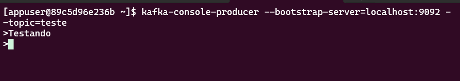
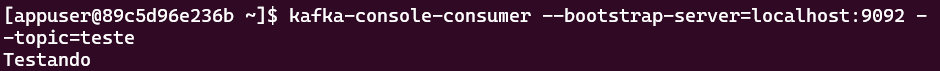
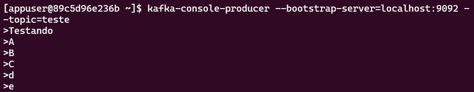
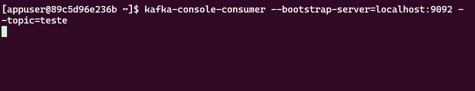
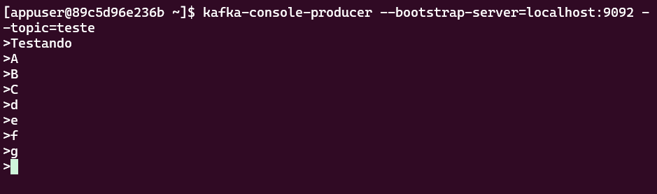
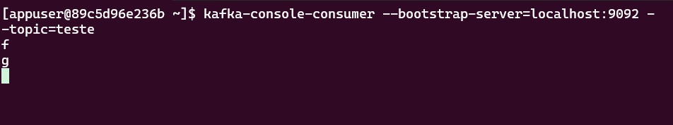
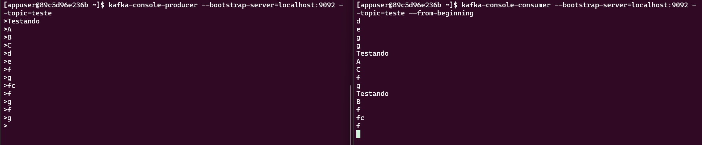
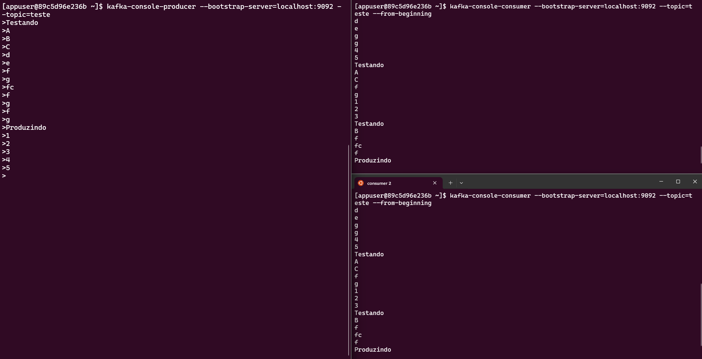
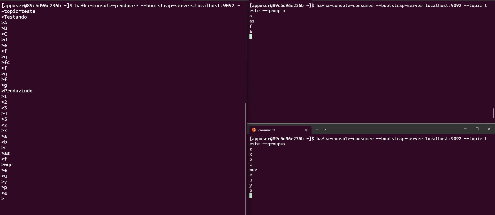

# Kafka Server
1. Run docker compose
```sh
docker compose up -d
```

2. View logs
```sh
docker logs kafka-kafka-1
```

3. Connect to kafka server machine
```sh
docker composse exec -it kafka-kafka-1 bash
```
# Kafka CLI
--bootstrap-server is a necesssary parameter to every kafka command.

## List topics
```sh
kafka-topics --list --bootstrap-server=localhost:9092
```

## Creating a topic
```sh
kafka-topics --create --topic=teste --bootstrap-server=localhost:9092 --partitions=3
```

- --create
    - Create a new topic.

- --partitions <Integer: # of partitions>  
    - The number of partitions for the topic being created or altered (WARNING: If partitions are increased for a topic that has a key, the partition logic or ordering of the messages will be affected). If not supplied for create, defaults to the cluster default.

- --bootstrap-server <String: server to connect to>                            
    - REQUIRED: The Kafka server to connect to. In case of providing this, a direct Zookeeper connection won't be required.

- --topic <String: topic>
    - The topic to create, alter, describe or delete. It also accepts a regular  expression, except for --create option. Put topic name in double quotes and use  the '\' prefix to escape regular expression symbols; e. g. "test\.topic". 


## List details: --describe
```sh
kafka-topics --bootstrap-server=localhost:9092 --topic=teste --describe
```

```
Topic: teste    PartitionCount: 3       ReplicationFactor: 1    Configs:
        Topic: teste    Partition: 0    Leader: 1       Replicas: 1     Isr: 1
        Topic: teste    Partition: 1    Leader: 1       Replicas: 1     Isr: 1
        Topic: teste    Partition: 2    Leader: 1       Replicas: 1     Isr: 1
```

## Create consumer
kafka-console-consumer --bootstrap-server=localhost:9092 --topic=teste 
--topic <String: topic>
--bootstrap-server <String: server to connect to>
--group <String: consumer group id>      The consumer group id of the consumer.
--from-beginning
The name of a class to use for formatting kafka messages for display. (default: kafka.tools. DefaultMessageFormatter)

## Create producer
```sh
kafka-console-producer --bootstrap-server=localhost:9092 --topic=teste
```

Sending message


Received message


## Stoping consumer
1. Stop consumer 
2. Send more messages

3. Start consumer (shows no messages)

4. Send more messages

5. Consumer don't read the messages sended when it was down

    - As mensagens não foram perdidas
    - O consumer apenas começou a ler as mensagens que foram enviadas pelo producer a partir do momento em que foi iniciado

## Consumer reads all messages
Para ler todas as mensagens enviadas pelo producer enquanto um consumer estiver parado.

As mensagens sao recebidas fora de ordem pois foram enviadas para partições diferentes. 

A ordem das mensagens só pode ser garantida quando usando `key`.

```sh
kafka-console-consumer --bootstrap-server=localhost:9092 --topic=teste --from-beginning
```



## Consumer Groups
### 1 producer e 2 consumers 



Fora de um grupo, os consumers leem todas as mensagens, pois sao consumidores totalmente independentes. 

Quando se quer ter mais workers, é necessário ter consumer groups.

Quando um producer é criado, ele já cria 3 partições. Cada mensagem é enviada para apenas uma partição.

Quando dois consumidores fazem parte de um mesmo grupo, cada um irá ler de uma partição diferente, logo não há possibilidade das mensagens serem lidas duas vezes.

### Dois consumers no mesmo grupo, lendo partições diferentes:
```sh
kafka-console-consumer --bootstrap-server=localhost:9092 --topic=teste --group=x
```



Pode-se notar que o consumer 2 leu mais mensagen, logo ele deve estar lendo duas partições e o consumer 1 apenas uma partição.